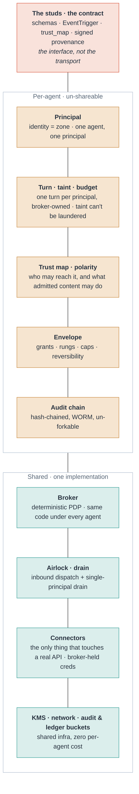
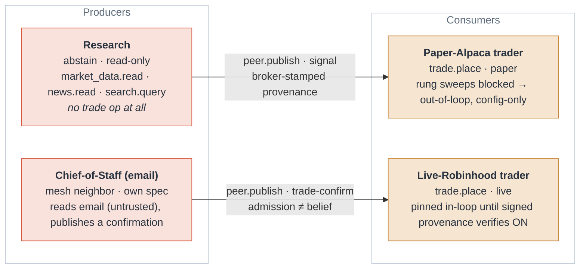
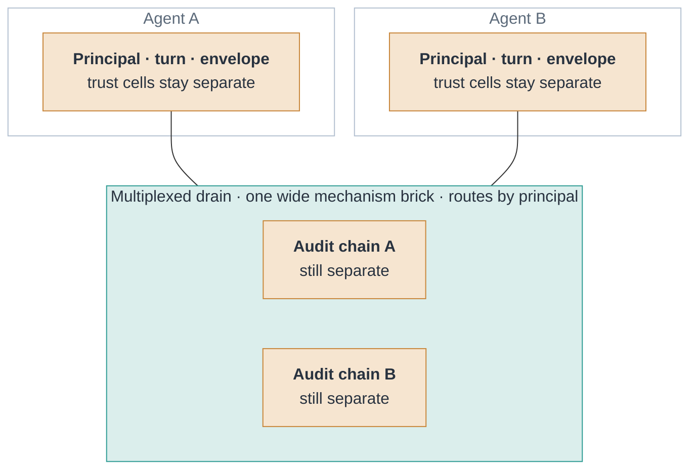

# Trust bricks: the safe-agents composition model

A visual companion to the two spec drafts, for readers who think in pictures. The full
interactive version is [`trust-bricks.html`](trust-bricks.html) (open it in any browser; it is
self-contained). The diagrams below are the same model in mermaid, rendered by GitHub inline.

The metaphor: an agent is one studded Lego stack. The **studs** are the contract, which is why
bricks compose at all. **Amber** bricks are per-agent trust cells that are never shared; a fully
compromised agent can still only *ask*, because these are its alone. **Teal** bricks are shared
mechanism: one implementation under every agent, so fifty agents is not fifty platforms.

Mapping to the specs: the studs (signed provenance, trust-map admission, the schema envelope)
are the **PTC** seam; the amber authority state (envelope, grants, rungs, and their lifecycle)
is what **GAL** governs.

## Plate 01: one agent is an atomic stack

## Plate 02: a mesh is bricks snapping stud-to-stud

One agent's emitter is another's receiver: a brokered `peer.publish` lands at the receiver's
airlock as `sender-class=peer-agent`. Same studs, so they just fit. The worked example is the
trading-agent set.

The two traders run one program; only provider and rung change. A signal is *data*: the trader
re-decides under its own polarity, so an approved peer is never a believed peer.

## Plate 03: grow by widening mechanism, never the boundary

Isolation is the default: identical stacks, one drain and one chain per agent, independent
blast radius. To spend fewer resources you widen a *mechanism* brick under the trust cells.
The shared brick still keeps each principal's chain separate inside it.

The rule: some bricks can never widen (principal, turn/taint, trust map, audit chain).
Everything you gain by multiplexing, you gain under those cells, never through them.
Isolated-vs-multiplexed is a per-deployment risk call, not part of the agent contract.

---

The trust boundary is per-agent and never shared. The mechanism behind it is shared code plus
shared infra plus a small per-agent resource set, and how much of that set is truly per-agent
versus multiplexed is a deployment dial, not part of the agent contract.

*Source diagrams in the safe-agents repo: `docs/scaling-and-mesh.md` (topology),
`docs/canonical-consumer.md` (consumer anatomy).*
